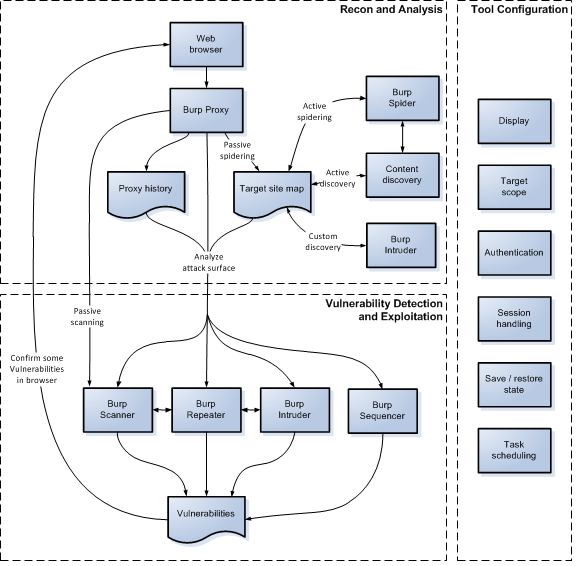

[帮助中心](https://support.portswigger.net/) >> [文档首页](../../index.md) >> [桌面版本](../index.md) >> [渗透测试](index.md)

本页适用于`专业版`及`社区版`

# 渗透测试

--------------

以下部分介绍了如何在Web应用程序测试中使用Burp Suite的基本知识。有关Web应用程序测试的一般技术和方法的更多信息，请参阅[Web应用程序黑客手册](http://mdsec.net/wahh/)，该文档由Burp Suite的创建者共同撰写。

你也可以在[Burp Suite 支持中心](https://support.portswigger.net/)查看

* [使用 Burp Suite](https://support.portswigger.net/customer/portal/topics/720229-using-burp-suite/articles)

## 使用Burp的基础知识

--------------

如果需要关于安装、启动、开始一个工程、配置显示选项等信息，请参阅 [开始入门](../getting-started/index.md#开始入门).

如果需要使用Burp来进行渗透测试，你需要先[配置你的浏览器](configuring-your-browser.md)，然后[安装Burp的根证书](../tools/proxy/options/installing-ca-certificate.md)。

如果您已经配置好浏览器并运行了Burp，您可以请转到`代理(Proxy)`选项卡中的`侦听器( Intercept)`选项卡，确保已打开侦听器拦截，如果按钮显示：`侦听器已关闭(Intercept is off)`，则单击它以切换拦截状态。然后转到您的浏览器并访问任何URL。

浏览器发出的每个HTTP请求都显示在`拦截(Intercept)`选项卡中。您可以查看每条消息，并根据需要进行编辑。然后单击`转发(Forward)`按钮将请求发送到目标Web服务器。如果浏览器卡在某个页面等待加载，则表示有截获的报文待处理，您需要转发所有这些报文，以便浏览器完成加载正在等待的页面。如果需要，您可以切换`拦截打开/关闭(Intercept is on / off)`按钮，以便正常浏览而不进行任何拦截。有关更多帮助，请参阅[Burp Proxy入门](../tools/proxy/getting-started.md)。

当您通过Burp浏览Web应用程序时，代理历史记录会记录所有请求和响应。在代理服务器中，转到`历史记录(HTTP history)`选项卡，查看您所做的一系列请求。选择表中的项目并在`请求(Request)`和`响应(Response)`选项卡中查看完整报文。

此外，在浏览页面时，Burp会自动构建目标应用程序的站点地图。转到`目标(Target)`选项卡和`站点地图(Site map)`子选项卡以查看此选项。站点地图包含您在浏览器中访问过的所有URL，以及Burp从您的请求响应中推断出的所有内容（例如，通过解析HTML响应中的链接）。已请求的项目以黑色显示，其他项目以灰色显示。您可以在树中展开分支，选择单个项目，并查看完整的请求和响应。有关更多帮助，请参阅[使用`目标(Target)`工具](../tools/target/using.md)。通过配置合适的[实时扫描任务](../scanning/live-scans.md)，您可以在浏览时设置将哪些内容添加到站点地图。

Burp渗透测试工作流程的核心是能够在Burp工具之间传递HTTP请求，以执行特定任务。您可以从`代理(Proxy)`选项卡中的`侦听器( Intercept)`，`历史记录(HTTP history)`，`目标(Target)`选项卡的`站点地图(Site map)`以及您看到HTTP消息的Burp中的任何其他位置发送消息。为此，请选择一条或多条消息，然后使用上下文菜单将请求发送到另一个工具。

您将用于特定任务的Burp工具如下：

* **[Scanner](../../scanner/index.md)** - 该工具用于自动扫描网站的内容和安全漏洞。
* **[Intruder](../tools/intruder/getting-started.md)** - 该工具用于您执行自定义的自动化攻击或各种测试。
* **[Repeater](../tools/repeater/using.md)** - 该工具用于手动修改发送单个的HTTP请求。
* **[Collaborator client](../tools/collaborator-client.md)** - 该工具用于生成Burp Collaborator有效载荷并监视所产生的其他交互。
* **[Clickbandit](../tools/clickbandit.md)** - 该工具用于生成针对目标站点的点击劫持攻击。
* **[Sequencer](../tools/sequencer/getting-started.md)** - 该工具用于分析Web应用程序会话令牌是否足够随机化。
* **[Decoder](../tools/decoder.md)** - 该工具用于进行常见的编码解码转换。
* **[Comparer](../tools/comparer.md)** - 该工具用于不同的HTTP报文之间的比较，对比寻找其中的差异，从而进一步发现问题。

您可以通过多种方式组合Burp的不同工具，执行从简单到高级再到专业的测试任务。

## 测试工作流

--------------

Burp允许您有效地结合手动和自动技术，使您可以完全控制Burp执行的所有操作，并提供有关您正在测试的应用程序的详细信息和分析。

有些用户可能不希望以这种方式使用Burp，只想对其应用程序执行快速简便的漏洞扫描。如果您有这样的需求，请参阅[扫描网站](../scanning/index.md)。

下图是Burp渗透测试工作流程关键部分的高级概述：

## 侦查和分析

--------------

[代理工具](../tools/proxy/using.md)是Burp工作流程的核心。它允许您使用浏览器浏览目标站点，而Burp会自动捕获所有相关信息并让您进一步进行操作。在大部分测试中，侦察和分析阶段涉及下述任务。

### 手动映射应用程序

通过Burp Proxy 使用浏览器[手动映射应用程序](../tools/target/using.md#manual-application-mapping)，之后在浏览器中点击链接，提交表单和单步执行多步骤过程。该过程将填充代理[`历史(HTTP history)`](../tools/proxy/using.md#using-the-proxy-history)和目标[`站点地图(Site map)`](../tools/target/site-map/index.md) 所有要求的内容，并(通过[`实时扫描(Live scans)`](../scanning/live-scans.md))将向网站地图添加任何可以从应用程序响应中推断出的更多内容（例如链接、表单等等。）。接下来您应该[查看任何未请求的项目](../tools/target/using.md#reviewing-unrequested-items)（在站点地图中以灰色显示），并使用您的浏览器请求这些项目。

### 必要时执行自动映射

您可以进行如下操作选择来以各种方式执行自动化映射过程：

* 执行[自动扫描](../scanning/index.md)以抓取应用程序的内容。
* 使用[内容发现](../functions/content-discovery.md)功能来查找更多内容。
* 使用`Burp Intruder`执行[自定义发现](../tools/intruder/using.md#enumerating-identifiers)，循环浏览并识别常用文件和目录列表。

请注意，在执行任何自动操作之前，可能需要更新Burp [配置](#工具配置)的各个方面，例如[目标范围](../tools/target/using.md#defining-target-scope)和[会话处理](../options/sessions/index.md)。

### 分析目标应用的攻击面

映射应用程序的过程会填充`代理(Proxy)`-[`历史(History)`](../tools/proxy/using.md#using-the-proxy-history)和`目标(Target)`-[`站点地图(Sitemap)`](../tools/target/site-map/index.md)，填充内容包含Burp捕获的目标应用程序的所有信息。这两个中都包含能够[帮助你](../tools/proxy/using.md#using-the-proxy-history)去[分析](../tools/target/using.md#analyzing-the-attack-surface)的它们包含的信息，并评估目标网站攻击面功能。此外您还可以使用Burp的[目标分析器](../functions/target-analyzer.md)来报告攻击面的范围以及目标网站使用的不同类型的URL。

## 工具配置

--------------

Burp包含大量[配置选项](../options/index.md)，它们通常需要在测试的不同阶段使用，以确保Burp以您需要的方式与目标应用程序一起使用。 例如：

* **显示** - 您可以配置[`HTTP消息字体(HTTP Message Font)`](../options/display.md#http-message-display)和[`字符集(Charset)`](../options/display.md#character-sets)用于显示HTTP消息，以及Burp自己[`UI中的字体(User Interface Font)`](../options/display.md#user-interface)。
* **目标范围** - [目标范围](../tools/target/scope.md)中会显示您当前设置的在本次项目中的范围。您应该在测试的早期配置它，因为它可以控制在`代理(Proxy)`-[`历史记录(history)`](../tools/proxy/history.md#proxy-history-display-filter)和`目标(Target)`-[`站点地图(site map)`](../tools/target/site-map/index.md#site-map-display-filter)中显示哪些项目，哪些消息是需要[拦截](../tools/proxy/options/index.md#intercepting-http-requests-and-responses)的，哪些项目可以[扫描](../scanning/index.md)的。
* **平台身份验证** - 如果目标网站采用了任何平台级别(HTTP)身份验证，则您可以配置Burp以自动处理有关[身份验证](../options/connections.md#platform-authentication)的问题。
* **会话处理** - 许多目标包含可能阻碍您自动或手动测试的一些操作，例如终止响应会话，每次请求需要使用令牌以及有状态的多个阶段过程。您可以[配置Burp](../options/sessions/index.md)使用[`会话处理规则(Session handling rules)`](../options/sessions/index.md#session-handling-rules)和[`宏(macros)`](../options/sessions/index.md#macros)无缝地处理大多数情况。
* **任务调度** - 您可以将Burp配置为[计划任务](../functions/task-scheduler.md)，使其可以在给定时间指定的测试窗口内工作。

## 漏洞检测和利用

--------------

在完成目标应用程序的[侦测和分析](#侦查和分析)以及Burp的任何必要的[工具配置](#工具配置)之后，您可以开始探测应用程序是否存在常见漏洞。在这个阶段，通常最有效的方法是同时使用多个Burp工具，在不同工具之间传递单个请求以执行不同的任务，并返回浏览器进行某些测试。在整个Burp中，您可以使用[上下文菜单](../functions/message-editor/index.md#context-menu-commands)在工具之间传递项目并执行其他操作。

在Burp的默认配置中，它会将通过代理的所有请求响应进行全自动的[实时被动扫描](../scanning/live-scans.md)。因此，在您开始主动探测应用程序之前，您可能会发现BurpScanner已经记录了一些需要进一步调查的[问题](../tools/target/site-map/index.md#issues-view)。

Burp的工具可以以多种不同的方式使用，以支持主动测试漏洞的过程。下面针对不同类型的问题描述了一些示例。

### 基于输入的问题

对于SQL注入，XSS和文件路径遍历等问题，您可以通过各种方式使用 Burp 来发现他们：

* 您可以使用Burp Scanner执行[扫描](../scanning/index.md)。在Burp中的任何位置选择项目，并使用上下文菜单来[启动扫描](../scanning/index.md#启动扫描)。或者，您可以将Burp配置为对通过代理的所有范围内请求执行[实时扫描](../scanning/live-scans.md)。
* 您可以使用Burp Intruder使用您自己的测试字符串和有效负载位置执行[`模糊测试(fuzzing)`](../tools/intruder/using.md#fuzzing-for-vulnerabilities)。
* 您可以将个别请求发送到[Burp Repeater](../tools/repeater/using.md)，一次又一次地手动修改和重新发出请求。
* 确定了某些类型的错误后，您可以使用[Burp Intruder](../tools/intruder/using.md)主动利用这些错误。例如，您可以针对SQL注入漏洞使用[`递归查找(Recursive grep)`](../tools/intruder/payloads/types.md#recursive-grep)来确定有效`攻击载荷类型(Payload Type)`。

### 逻辑和设计缺陷

对于一些逻辑方面或是设计上的问题，例如重置密码跳过关键步骤等问题，您通常需要手动进行操作：

* 大部分情况下你可以仔细查看[代理历史](../tools/proxy/using.md#using-the-proxy-history)来确定需要的相关请求。
* 您可以通过使用[Burp Repeater](../tools/repeater/using.md)或打开代理[`拦截(Intercept)`](../tools/proxy/using.md#intercepting-requests-and-responses)来单独发出这些请求以探测应用程序对意外请求的处理并在使用浏览器浏览目标站点时动态的更改请求。
* 您可以使用[Burp Intruder](../tools/intruder/using.md)来利用一些逻辑和设计上的缺陷。例如，Intruder可用于爆破账号密码，爆破可预测或是有一定规律的会话领跑或是密码恢复令牌，某些情况下甚至只需要使用[`空的攻击载荷(nullpayloads)`](../tools/intruder/payloads/types.md#null-payloads)重放请求即可完成漏洞检测。
* 确认了逻辑或设计缺陷后，可以通过使用Burp Proxy的[`匹配/替换功能(Match and Replace)`](../tools/proxy/options/index.md#match-and-replace)或[`会话处理规则(Session handling rules)`](../options/sessions/index.md#session-handling-rules)自动更改请求以利用其中的漏洞。

### 访问控制问题

Burp 包含一些在测试访问控制漏洞时可以提供帮助的功能：

* 您可以使用[比较站点地图](../tools/target/site-map/comparison.md)功能执行各种任务，例如
  * 查看两个用户之间的功能区别
  * 测试低权限用户是否可以访问高权限用户的功能
  * 发现用户特定标识符被用于隔离同一类型的两个用户对数据的访问的位置。
* 您可以使用不同的浏览器在不同的用户上下文中访问应用程序，并为每个浏览器使用单独的[`Burp 代理监听端口(Burp Proxy listener)`](../tools/proxy/options/index.md#proxy-listeners)。然后，您可以通过上下文菜单打开`代理(Proxy)`-[`历史记录(History)`](../tools/proxy/history.md)窗口并设置[`过滤器(Filter)`](../tools/proxy/history.md#proxy-history-display-filter)以显示在特定端口上接收的项目。当您在每个浏览器中使用该应用程序时，每个历史记录窗口将仅显示相关用户上下文的项目。然后，您可以通过上下文菜单使用`在当前浏览器会话中的浏览器中请求`功能在浏览器之间切换请求，以确定在浏览器中的用户如何处理它们。
* 当应用程序在请求参数中传递用户标识符时，会出现许多权限提升漏洞，并使用该标识符来标识当前用户上下文。您可以通过使用[Burp Intruder](../tools/intruder/using.md)以适当的格式循环迭代标识符来利用此类漏洞，例如使用[`数字类型(Number)`](../tools/intruder/payloads/types.md#numbers)或[`自定义类型(customiterator)`](../tools/intruder/payloads/types.md#custom-iterator)来生产有效载荷类型，然后配置[`提取匹配内容(Extract grep)`](../tools/intruder/options.md#grep-extract)从应用程序的响应中检索用户的特定数据。

### 其他漏洞

Burp包含的功能可以用于传递，并且通常可以自动执行在探测其他类型的漏洞时出现的任何任务。 例如：

* 您可以在`目标(Target)`-[`站点地图(Sitemap)`](../functions/search.md#text-search)中查看一些信息泄漏问题，使用[`搜索(Search)`](../functions/search.md#text)或[`查找注释(Find comments)`](../functions/search.md#find-comments-and-scripts)功能来寻找某些值得深入的点。
* 确定了可能的CSRF漏洞后，您可以使用[CSRF生成器](../functions/generate-csrf-poc.md)在HTML中快速创建POC，然后使用`在浏览器中测试(Test in browser)`功能将攻击载荷加载到浏览器中，然后查看浏览器结果和`代理(Proxy)`-[`历史记录(History)`](../tools/proxy/using.md#using-the-proxy-history)以验证攻击是否成功。
* 您可以使用[Burp Sequencer](../tools/sequencer/index.md)分析来自应用程序的会话令牌样本，并估计其随机性的质量。
* 对于某些类型的加密会话令牌或其他参数，您可以在Burp Intruder中使用[`位反转(bit flipper)`](../tools/intruder/payloads/types.md#bit-flipper)和[`ECB块重排(ECB block shuffler)`](../tools/inpinder/payloads/types.md#ecb-block-shuffler)载荷类型来进行模糊测试。
* 您可以编写自己的自定义Burp[`插件(Extensions)`](../tools/extender.md)来执行更专业或自定义的任务。

## 了解更多

--------------

有关Burp所有工具和功能的大量文档，以及在使用Burp进行测试时需要使用的典型工作流程。

使用以下链接获取有关使用每个主要Burp工具的帮助：

* [使用 Burp Target](../tools/target/using.md)
* [使用 Burp Proxy](../tools/proxy/using.md)
* [使用 Burp Intruder](../tools/intruder/using.md)
* [使用 Burp Repeater](../tools/repeater/using.md)
* [扫描目标网站](../scanning/index.md)